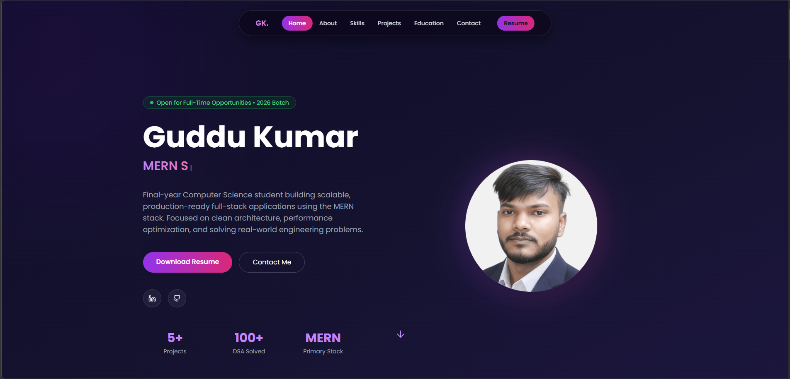

# 🚀 Guddu Kumar – Developer Portfolio  


<p align="center">
  <a href="https://guddukumar.co.in" target="_blank">
    
  </a>
  <a href="https://github.com/guddukumarx" target="_blank">
    
  </a>
  
  
</p>

---

## 👨‍💻 About The Project  

This is my personal **Developer Portfolio Website** built using modern frontend technologies.  
It showcases my:

- 💼 Projects  
- 🛠️ Technical Skills  
- 📜 Certifications  
- 📄 Resume  
- 📬 Contact Details  

The goal of this portfolio is to represent my development skills professionally and create a strong online presence.

---

## 🛠️ Tech Stack  

### 🎨 Frontend
- React.js  
- Tailwind CSS  
- Framer Motion  
- React Icons  

### ⚙️ Tools & Deployment
- Git & GitHub  
- VS Code  
- Vercel / Netlify  

---

## ✨ Features  

- ⚡ Modern & Clean UI  
- 📱 Fully Responsive Design  
- 🎭 Smooth Animations  
- 🌙 Dark Theme  
- 📄 Download Resume Option  
- 📬 Contact Form Section  
- 🚀 Fast Loading & Optimized Performance  
- 🔍 SEO Friendly Structure  

---

## 📂 Project Structure  

```
guddukumar-portfolio/
│── public/
│── src/
│   ├── components/
│   ├── sections/
│   ├── assets/
│   ├── App.js
│   └── index.js
│── package.json
│── tailwind.config.js
│── README.md
```

---

## ⚡ Getting Started  

### 1️⃣ Clone the Repository

```
git clone https://github.com/guddukumarx/guddukumar-portfolio.git
```

### 2️⃣ Navigate into the Folder

```
cd guddukumar-portfolio
```

### 3️⃣ Install Dependencies

```
npm install
```

### 4️⃣ Start Development Server

```
npm start
```

App will run on:

```
http://localhost:3000
```

---

## 📦 Build for Production  

```
npm run build
```

Optimized production files will be available inside the `build/` folder.

---

## 📸 Preview  

(Add your homepage screenshot here)

After uploading screenshot file to repo, use:

```

```

---

## 🌐 Connect With Me  

- 🌍 Portfolio: https://guddukumar.co.in  
- 💼 LinkedIn: https://linkedin.com/in/guddukumarx  
- 🖥️ GitHub: https://github.com/guddukumarx  
- 📧 Email: guddukumar.codes@gmail.com

---

## 🧑‍💻 Author  

**Guddu Kumar**  
B.Tech CSE Final Year Student  
Full Stack Developer | MERN Stack Enthusiast  

---

## ⭐ Support  

If you like this project, please give it a ⭐ on GitHub.  
It motivates me to build more awesome projects 🚀
